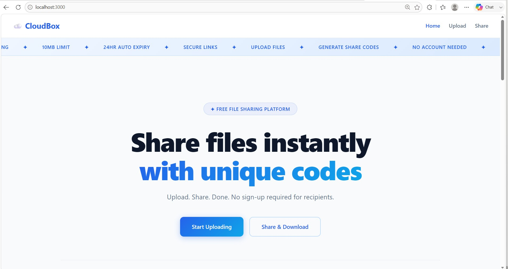

# ☁️ CloudBox — File Sharing Platform

> A web-based file sharing platform that allows users to upload files and generate unique share codes for instant file distribution. No account required for recipients.

[](https://nodeexpressmongoes6-cloudbox.onrender.com)
[](https://github.com/zhitengg7898-design/nodeExpressMongoES6_cloudBox)

---

## 👤 Authors

| Field | Student 1 | Student 2 |
|-------|-----------|-----------|
| **Name** | Smitkumar Jayendrakumar Velani | Zhiteng Guo |
| **Email** | velanismitkumar@gmail.com | guo.zhit@northeastern.edu |
| **GitHub** | [Smit-Velani](https://github.com/Smit-Velani) | [zhitengg7898-design](https://github.com/zhitengg7898-design) |
| **Published** | June 2026 | June 2026 |

---

## 🎓 Class

**CS5610 — Web Development**
Khoury College of Computer Sciences, Northeastern University
🔗 [Course Page](https://johnguerra.co/classes/webDevelopment_online_summer_2026/)

---

## 🎯 Project Objective

CloudBox is a full-stack file sharing platform built with Node.js, Express, MongoDB, and vanilla ES6 JavaScript. Users can upload files, generate unique share codes, and send them to anyone — no account required for recipients. The platform supports file expiration, download tracking, and complete file management.

**The problem we solve:** Sharing files with others is often more complicated than it should be. Existing solutions require multiple steps, account access, or permission settings. CloudBox lets users upload a file, get a share code, and share it in seconds.

---

## 📸 Screenshot



> Live at: **https://nodeexpressmongoes6-cloudbox.onrender.com**

---

## 🎥 Demo Video

📹 [Watch Demo on YouTube](https://youtu.be/ktV9su4Brd8?si=Py8eplLhxuu1IOKz)

---

## 🗂️ Project Structure

```
nodeExpressMongoES6_cloudBox/
├── 📄 backend.js                    # Main Express server
├── 📁 backend/
│   ├── db.js                        # MongoDB connection module
│   └── filesRoutes.js               # All API routes (files + share codes)
├── 📁 frontend/
│   ├── index.html                   # Home page
│   ├── upload.html                  # File upload and management page
│   ├── share.html                   # Share code generation and access page
│   ├── 📁 css/
│   │   ├── main.css                 # Global styles
│   │   ├── home.css                 # Home page styles
│   │   ├── upload.css               # Upload page styles
│   │   └── share.css                # Share page styles
│   └── 📁 js/
│       ├── frontend.js              # Home page JS
│       ├── upload.js                # Upload page JS
│       └── share.js                 # Share page JS
├── 📁 uploads/                      # Uploaded files (gitignored)
├── 📄 seed.js                       # Database seeding script (1000+ records)
├── 📄 .env.example                  # Environment variables template
├── 📄 .gitignore                    # Git ignore rules
├── 📄 eslint.config.mjs             # ESLint configuration
├── 📄 .prettierrc                   # Prettier configuration
├── 📄 package.json                  # Project dependencies
├── 📄 LICENSE                       # MIT License
└── 📄 README.md                     # This file
```

---

## ✨ Features

**File Upload and Management (Smitkumar Velani)**
- Drag and drop or click to upload any file up to 10MB
- View all uploaded files with metadata
- Edit file descriptions
- Delete files with custom confirmation modal
- Client side rendering with vanilla ES6

**File Sharing and Access (Zhiteng Guo)**
- Generate unique 8-character share codes for any uploaded file
- Set custom expiry time (1 to 168 hours)
- Access shared files using share code — no account needed
- Download shared files directly
- Auto-expiry prevents access after expiration

**Technical**
- 2 MongoDB collections: `files` and `shareCodes`
- RESTful API with full CRUD on both collections
- ES6 modules throughout — no CommonJS require
- CSS organized in separate module files
- No Mongoose, no template engines, no React

---

## 🛠️ Instructions to Build

### Prerequisites
- [Node.js](https://nodejs.org/) v18 or higher
- [npm](https://www.npmjs.com/)
- [MongoDB](https://www.mongodb.com/) (local or Atlas)

### Installation

```bash
# Clone the repository
git clone https://github.com/zhitengg7898-design/nodeExpressMongoES6_cloudBox.git

# Navigate into the project
cd nodeExpressMongoES6_cloudBox

# Install dependencies
npm install
```

### Environment Setup

```bash
# Copy the example env file
cp .env.example .env

# Edit .env with your MongoDB connection string
# MONGODB_URI=mongodb://localhost:27017/cloudbox
# PORT=3000
```

### Running Locally

```bash
# Development mode with auto-reload
npm run dev

# Production mode
npm start
```

Open your browser and go to: `http://localhost:3000`

### Seed Database (optional)

```bash
# Add 1000+ sample records to the database
node seed.js
```

### Linting and Formatting

```bash
# Run ESLint
npx eslint .

# Format with Prettier
npm run format
```

---

## 🔌 API Endpoints

### Files Collection
| Method | Endpoint | Description |
|--------|----------|-------------|
| POST | `/api/upload` | Upload a new file |
| GET | `/api/files` | Get all files |
| GET | `/api/files/:id` | Get single file details |
| PUT | `/api/files/:id` | Update file description |
| DELETE | `/api/files/:id` | Delete a file |

### Share Codes Collection
| Method | Endpoint | Description |
|--------|----------|-------------|
| POST | `/api/files/:id/share` | Generate share code for a file |
| GET | `/api/share/:code` | Get file details by share code |
| GET | `/api/share/:code/download` | Download file by share code |
| PUT | `/api/share/:code` | Update share code settings |
| DELETE | `/api/share/:code` | Delete a share code |

---

## 🗄️ Database

**MongoDB with 2 collections:**

**`files` collection:**
```json
{
  "_id": "ObjectId",
  "originalName": "document.pdf",
  "storedName": "1234567890-document.pdf",
  "size": 102400,
  "mimetype": "application/pdf",
  "uploadedAt": "2026-06-21T00:00:00Z",
  "description": "My document"
}
```

**`shareCodes` collection:**
```json
{
  "_id": "ObjectId",
  "fileId": "ObjectId",
  "shareCode": "Ab3Xy7Zk",
  "shareEnabled": true,
  "shareCreatedAt": "2026-06-21T00:00:00Z",
  "expiresAt": "2026-06-22T00:00:00Z",
  "downloadCount": 0
}
```

---

## 🔒 Security

- MongoDB credentials stored in `.env` file (never committed to GitHub)
- `.env.example` provided as a template with no real credentials
- File size limited to 10MB to prevent abuse
- Share codes expire automatically to reduce storage
- `uploads/` folder is gitignored

---

## 🤖 GenAI Tools

| Tool | Version | Usage |
|------|---------|-------|
| Claude | claude-sonnet-4-6 (Anthropic) | UI design, CSS styling, README structure, Design Document |

**How it was used:**
- **Home Page UI** — Claude helped design the home page layout including ticker animation, hero section, how-it-works steps, and features grid
- **CSS Styling** — Claude assisted with CSS module files including responsive grid layouts and hover animations
- **Upload Page** — Claude helped design the drag and drop upload zone, file cards, details modal, and custom delete confirmation modal
- **Share Page** — Claude helped design the two-card layout for share code generation and file access
- **README** — Claude helped structure the README with all required sections
- **Design Document** — Claude assisted in writing user personas, user stories, and wireframe descriptions

**What was NOT AI generated:**
- MongoDB connection module and collection setup
- Express REST API routes for files and share codes
- File upload implementation using Multer
- Share code generation algorithm
- Seed script for 1000+ records
- Render deployment configuration

---

## 📄 License

This project is licensed under the **MIT License** — see the [LICENSE](LICENSE) file for details.

---

## 📋 Design Document

The full design document including project description, user personas, user stories, and design mockups is available here:

📄 [DESIGN.md](DESIGN.md)

---
<p align="center">
  Built by <strong>Smitkumar Jayendrakumar Velani</strong> and <strong>Zhiteng Guo</strong> &middot; CS5610 Web Development &middot; Northeastern University &middot; June 2026
</p>
